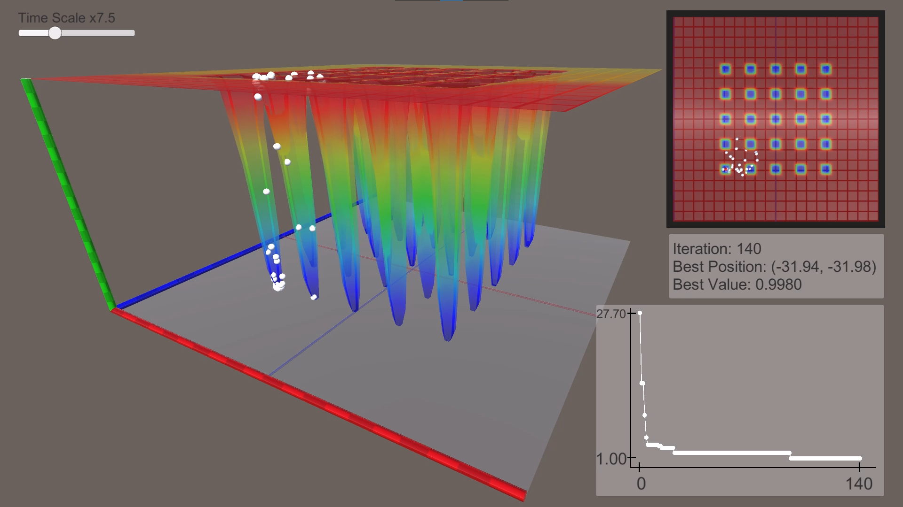
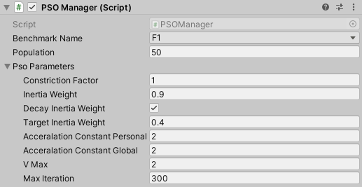

# Particle Swarm Optimization (PSO)



## 概要
PSOを用いて2次元関数の最適化（最小化）を実行します．
ベンチマーク用の関数にDeJongの関数が用意されています．
パラメタを色々と変更して実行することができます．

## 実行方法
0. Unityバージョン`2021.3.2f1`
1. このプロジェクトをUnity Hubから開いて，シーン`./Assets/Scenes/PSO.unity`を開く．
2. Hierarchyタブで`PSOManager`を探して選択する．
3. Inspectorタブで
  - 最適化する関数（`Benchmark Name`）
  - PSOのパラメタ（`Pso Parameters`）
を適宜変更する．

4. 画面上部の再生ボタンを押してシーンを実行する．

## 変更できるパラメタ

| Inspectorタブ上の名前          | 数式上の変数 | 概要                                     | 
| :----------------------------: | :----------: | :--------------------------------------: | 
| Optimization                   | -            | 最小化（Minimization）または最大化（Maximization） | 
| Population                     | -            | 粒子の数                                 | 
| Constriction Factor            | $\chi$       | 収束係数                                 | 
| Inertia Weight                 | $\omega$     | 減衰係数                                 | 
| Decay Inertia Weight           | -            | 減衰係数を線形に減少させる               | 
| Target Inertia Weight          | -            | 減衰係数を減少させる場合の目標値         | 
| Acceralation Constant Personal | $\phi_p$     | 個体が獲得した最適点に引きつけられる強さ | 
| Acceralation Constant Global   | $\phi_g$     | 全体が獲得した最適点に引きつけられる強さ | 
| VMax                           | -            | 最大速度                                 | 
| Max Iteration                  | -            | 最大反復回数                             | 

### PSOの更新式
$$
\boldsymbol{v}_i \leftarrow 
\chi \left( 
    \omega\boldsymbol{v}_i 
    + \phi_p\boldsymbol{r}_p\odot\left(\boldsymbol{x}_p-\boldsymbol{x}_i\right) 
    + \phi_g\boldsymbol{r}_g\odot\left(\boldsymbol{x}_g-\boldsymbol{x}_i\right) 
\right)
$$

|                                      |                            | 
| :----------------------------------: | :------------------------: | 
| $\boldsymbol{x}_i, \boldsymbol{v}_i$ | 粒子の位置・速度           | 
| $\boldsymbol{x}_p, \boldsymbol{x}_g$ | 個体・全体が獲得した最適点 | 
| $\boldsymbol{r}_p, \boldsymbol{r}_g$ | 乱数値 $[0, 1]$            | 

## 他の関数の最適化
DeJongの関数以外の関数も新しく定義して最適化を行うことができます．手順は以下の通りです．

1. `Benchmark Name`を`Custom`に設定する．（Unity Editor上`PSOManager`のInspectorタブ）
2. `./Assets/Scripts/CustomFunction.cs`をテキストエディタなどで開く．
3. 定義域（`DomainMin`・`DomainMax`）と関数の実装（`Evaluate`）を適当に書き換える．
   ```cs
   // ./Assets/Scripts/CustomFunction.cs
   public class CustomFunction : IBenchmark
   {
       public Vector2 DomainMin
       {
           get { return new Vector2(-5.12f, -5.12f); }
       }
       public Vector2 DomainMax
       {
           get { return new Vector2(5.12f, 5.12f); }
       }
   
       public float Evaluate(Vector2 x)
       {
           return x[0] * x[0] + x[1] * x[1];
       }
   }
   ```
4. ファイルを上書き保存してからUnityシーンを実行する．

### 注意点
- 定義域は有界閉区間です．（両端が含まれます．）
- 関数は有界である必要があります．適宜`Mathf.Clamp()`などを利用して`Evaluate()`の返り値が有限の値になるようにしてください．0除算にも気を付けてください．
- デフォルトでは，関数の最小化を行います．最大化を行うには，Unity Editor上`PSOManager`のInspectorタブで`Maximization`にチェックを入れます．
- DeJongの関数の`F4`のようにノイズがある関数をノイズなしで表示するには，`Display()`を定義してください．（参考：`./Assets/Scripts/DeJongFunction.cs`の`F4`）

## その他
- `PSOManager.updateNoisySurface`にチェックを入れるとノイズがある関数（`F4`）をノイズ込みで表示できる．
- Sceneビューで視点を自由に変更できる．Gameビューにその視点を反映させるには，Hierarchyタブから`Other>Main Camera`を選んで，`Ctrl + Shift + f`を押してカメラの位置を変更することができる．
